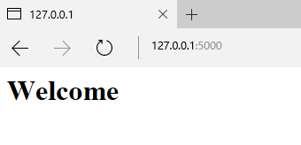
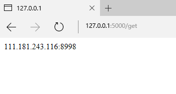
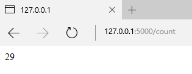
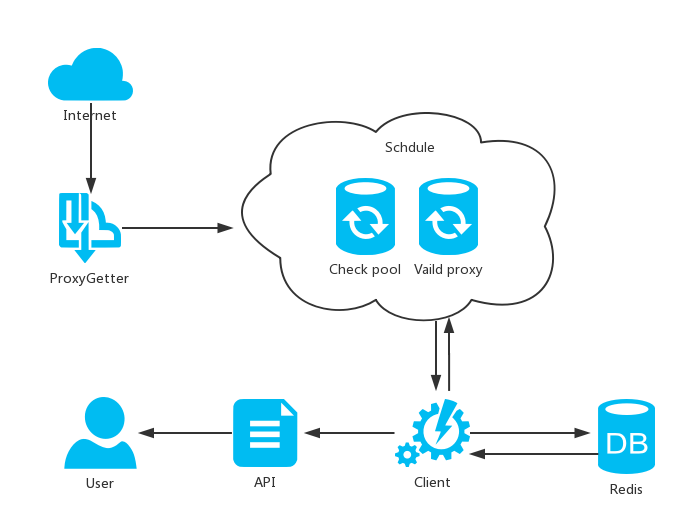

# ProxyPool

IP 代理池，Python 实现，基于 Redis 存储，支持网页 API 获取代理，理论可跨语言使用。  
代理是通过爬虫获取免费代理，并通过定期测试对代理进行评分，循环维持可用性。

## 运行环境

* Python 3.6

  (请务必保证 Python 版本在3.6以上，否则异步检验无法使用。)

* Redis 

  Redis 官网并没有提供 Windows 安装版，Windows用户可以[点击此处](https://github.com/MicrosoftArchive/redis/releases)下载微软小组开发版本；  
  安装后将 Redis 启动。

## 安装

#### 安装依赖

`$ pip install -r requirements.txt`

*Windows 用户如果无法安装 lxml 库请[点击这里](http://www.lfd.uci.edu/~gohlke/pythonlibs/)*。
#### 配置

进入 proxypool 目录，修改 config.py 文件；  
另外建议先更新一下抓取代理的爬虫。

#### 运行

`$ cd proxypool`

`$ python3 run.py `

## 使用 API 获取代理

访问`http://127.0.0.1:5000/`进入主页，如果显示 'Welcome'，证明成功启动。



访问`http://127.0.0.1:5000/get`可以获取一个可用代理。  



访问`http://127.0.0.1:5000/count`可以获取代理池中可用代理的数量。  



也可以在程序代码中用相应的语言获取，例如:

```
import requests

def get_proxy():
    r = requests.get('http://127.0.0.1:5000/get')
    return r.text
```
## 文件结构
* config.py
> 参数配置模块

* dbop.py
>数据库操作模块，基于 Redis

* parser.py
> 请求解析模块，支持重试和加载代理

* spider.py
> 定义所有代理爬虫类

* webapi.py
> 实现网页接口，基于 Flask

* schedule/adder.py
> 添加器，用于启动爬虫添加代理

* schedule/tester.py
> 测试器，用于检测代理的可用性

* schedule/scheduler.py
> 调度器，用于周期性检测并适时启动上面两者

## 流程图



## 鸣谢
本项目基于 [@WiseDoge][1] 版本重写。


  [1]: https://github.com/WiseDoge/ProxyPool